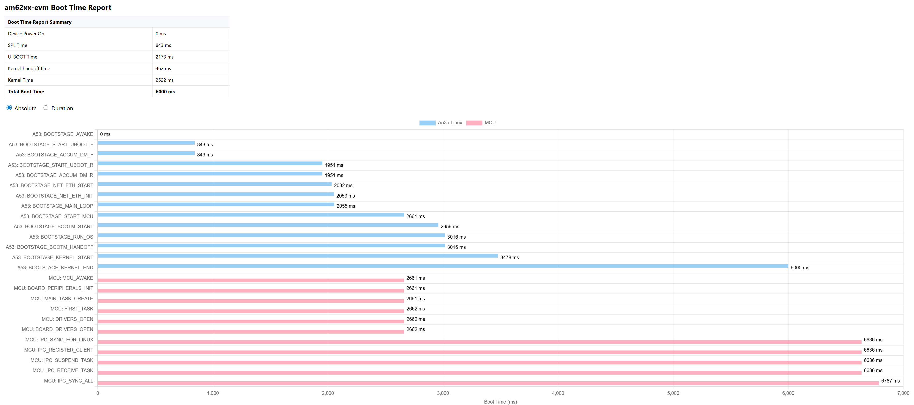
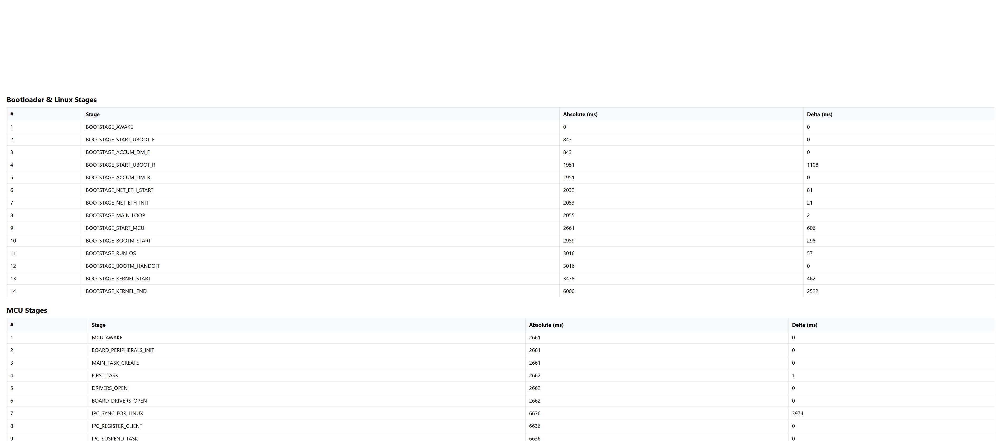
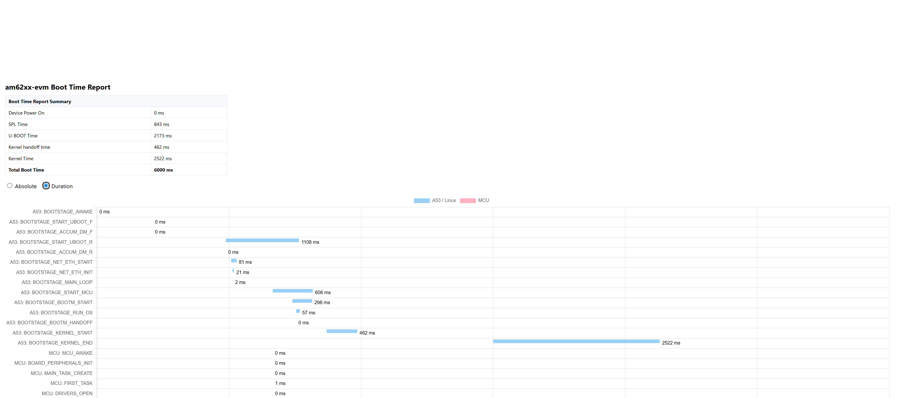

# Boot Time Parser

This project provides a unified boot time measurement framework for embedded platforms with heterogeneous compute architecture (e.g., ARM + MCU/DSP). It captures precise boot stage timestamps from SPL, U-Boot, Kernel, other subsystems like MCU/DSPs, enabling developers to analyze and optimize end-to-end boot latency.

## ✨ Key Features

- Architecture-agnostic design (supports ARM64, x86, MIPS, etc.)
- Hardware counter–based timestamping (e.g., CNTVCT_EL0 on ARM64)
- Common Linux kernel API: `boot_time_now()` for nanosecond timestamps
- Boot stage logging for:
  - SPL
  - U-Boot
  - Kernel start/init
  - MCU firmware
  - First user-space app
- Lightweight C-based parser to generate boot report
- Output report in human-readable and graphical format

## ⚙️ Build & Install

```bash
mkdir build
cd build
cmake ..
make
sudo make install

📊 Sample Boot Report

+--------------------------------------------------------------------+
                 am62xx-evm Boot Time Report 
+--------------------------------------------------------------------+
Device Power On         : 0 ms
SPL Time                : 843 ms
U-Boot Time             : 2173 ms
Kernel handoff time     : 462 ms
Kernel Time             : 2522 ms
Total Boot Time         : 6000 ms
+--------------------------------------------------------------------+

+--------------------------------------------------------------------+
                 Bootloader and Kernel Boot Records
+--------------------------------------------------------------------+
BOOTSTAGE_AWAKE                =      0 ms (+  0 ms)
BOOTSTAGE_START_UBOOT_F        =    843 ms (+  0 ms)
BOOTSTAGE_ACCUM_DM_F           =    843 ms (+  0 ms)
BOOTSTAGE_START_UBOOT_R        =   1951 ms (+1108 ms)
BOOTSTAGE_ACCUM_DM_R           =   1951 ms (+  0 ms)
BOOTSTAGE_NET_ETH_START        =   2032 ms (+ 81 ms)
BOOTSTAGE_NET_ETH_INIT         =   2053 ms (+ 21 ms)
BOOTSTAGE_MAIN_LOOP            =   2055 ms (+  2 ms)
BOOTSTAGE_START_MCU            =   2661 ms (+606 ms)
BOOTSTAGE_BOOTM_START          =   2959 ms (+298 ms)
BOOTSTAGE_RUN_OS               =   3016 ms (+ 57 ms)
BOOTSTAGE_BOOTM_HANDOFF        =   3016 ms (+  0 ms)
BOOTSTAGE_KERNEL_START         =   3478 ms (+462 ms)
BOOTSTAGE_KERNEL_END           =   6000 ms (+2522 ms)
+--------------------------------------------------------------------+

+--------------------------------------------------------------------+
                 MCU Boot Records 
+--------------------------------------------------------------------+
MCU_AWAKE                      =   2661 ms (+  0 ms)
BOARD_PERIPHERALS_INIT         =   2661 ms (+  0 ms)
MAIN_TASK_CREATE               =   2661 ms (+  0 ms)
FIRST_TASK                     =   2662 ms (+  1 ms)
DRIVERS_OPEN                   =   2662 ms (+  0 ms)
BOARD_DRIVERS_OPEN             =   2662 ms (+  0 ms)
IPC_SYNC_FOR_LINUX             =   6636 ms (+3974 ms)
IPC_REGISTER_CLIENT            =   6636 ms (+  0 ms)
IPC_SUSPEND_TASK               =   6636 ms (+  0 ms)
IPC_RECEIVE_TASK               =   6636 ms (+  0 ms)
IPC_SYNC_ALL                   =   6787 ms (+151 ms)
+--------------------------------------------------------------------+






📌 Usage

1. Enable Boot stage logging feature in uboot and Kernel

2. Build and install the user-space utility

3. Run the tool post-boot:

sudo boot_time_report_parser


🛠 Platforms Tested

TI Sitara AM62x (Linux SDK 11.0+)

ARM Cortex-A53 with Cortex-M4 MCU

U-Boot 2024.x

Linux Kernel 6.12+


📄 License

BSD 3-Clause

---

🤝 Contributing

We welcome contributions! Please follow standard GitHub practices and submit a pull request. Make sure to run clang-format and check coding style before submitting.

🔗 References

TI Linux SDK Documentation

U-Boot Bootstage

Linux Kernel Timing APIs

